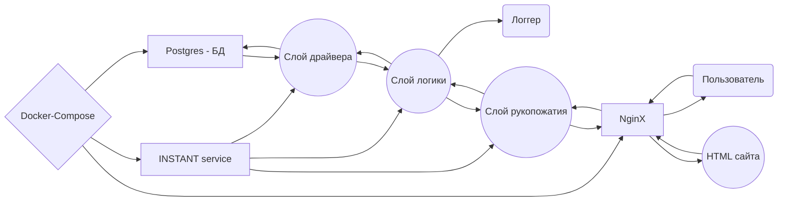

# INSTANT

Мессенджер, заточенный на приватность и быстродействие.

### Структура проекта

```
.
├── docker-compose.yml .................... Конфигурационный файл docker-compose
├── instant/
│   ├── cmd/
│   │   └── instant.go .................... Точка входа для серверной программы
│   ├── config/
│   │   └── example.env ................... Пример конфигурационного файла сервера INSTANT
│   ├── db/
│   │   └── migrations/ ................... Миграции для базы данных
│   ├── Dockerfile ........................ Конфигурационнный файл docker
│   ├── internal/
│   │   ├── config/
│   │   │   ├── config.go ................. Парсер конфигурационного файла
│   │   │   └── entity.go ................. type Config struct {...}
│   │   ├── security/
│   │   │   ├── entity.go ................. Структуры слоя рукопожатия
│   │   │   └── security.go ............... Слой рукопожатия. Протокол безопасной передачи данных
│   │   └── transport/
│   │       ├── entity.go ................. struct для всех возможных запросов и ответов
│   │       ├── transport.go .............. Логика работы сервера
│   │       └── utils.go .................. Спецфункции, которые было удобно вынести
│   ├── Makefile .......................... aliasы для удобства
│   └── pkg/
│       ├── aes/
│       │   └── aes.go .................... Имплементация AES-256 (Galois-Counter Mode)
│       ├── logger/
│       │   └── logger.go ................. Логгер. Используется zap
│       └── postgres/
│           ├── entity.go ................. Типы данных для работы с базой данных.
│           └── postgres.go ............... Логика работы с базой данных. Драйвер pgx.
├── Makefile .............................. aliasы для удобства
├── nginx/
│   └── nginx.conf ........................ Конфигурационный файл Nginx
├── README.md ............................. Вы это читаете
└── website/
    ├── ru/ ............................... Сайт, русский язык
    ├── en/ ............................... Сайт, английский язык
    ├── in/ ............................... Сайт, индонезийский язык
    ├── INSTANT.apk ....................... Пакет приложения
    ├── INSTANT_logo.png .................. Логотип INSTANT
    └── style.css ......................... Стили для сайта
```


